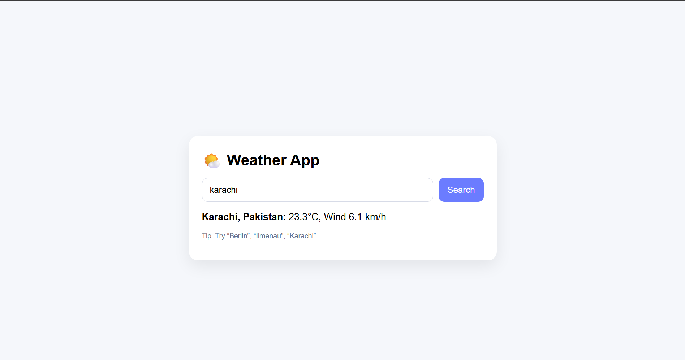

# 🌤️ Weather App (React + Open-Meteo API)

A simple React application that fetches real-time weather data without requiring an API key.

## 🚀 Live Demo
https://weather-app-1xog.vercel.app/
## Screenshot

## ✨ Features
- Search weather by city name
- Displays temperature and wind speed
- Uses Axios for API requests
- Clean and modern UI
- No API key required

## 🛠️ Technologies Used
- React
- Axios
- Open-Meteo API
- CSS

## 📦 Setup Instructions

1. Install dependencies
   npm install

2. Run the project
   npm start

The app will be available at http://localhost:3000 in your browser.
